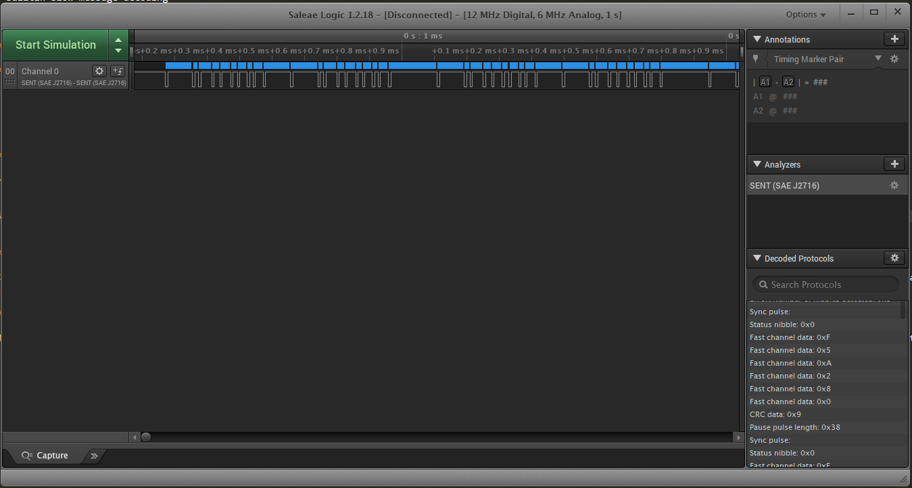
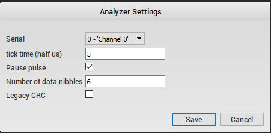

# SENT (SAE J2716) Analyzer for Saleae USB logic analyzer

This plugin allows decoding SENT frames of up to 6 data nibbles and allows exporting the nibble data for further postprocessing

## Wishlist:

- Builtin slow message decoding
- Automatic detection of tick time
- SPC support

## Building the plugin:

### Windows:

- Open "Visual Studio/SENTAnalyzer.sln" to open project in visual studio
- Depending on the version used, vs might ask to upgrade the project files
- Default build configuration is for "win32". You likely need to change this to "x64"
- Build project. Dll file is generated in "Visual Studio\x64\Release\SENTAnalyzer.dll" 

### Linux/OSX:

run the build_analyzer.py script. The compiled libraries can be found in the newly created debug and release folders.

```
python build_analyzer.py
```

## Installing the plugin:

Copy the .dll/.so over to the Saleae Logic analyzer folder. You can either copy it to the "Analyzers" folder in the Saleae Logic installation directory, or specify a custom path under "Preferences --> Developer"

## Testing the installation:

When installed, the plugin can be tested (in the absence of an actual SENT signal) by loading the analyzer (it should show up in the list now) and hitting the "Start simulation" button. Note that for this to work, the Saleae Logic analyzer should not be connected to the computer.



## Configuring the plugin:

The plugin can be configured in a number of ways to support various SENT configurations.



- Serial: Used to select which input channel contains the SENT signal
- tick time (half us): The tick time of the SENT signal. Due to some limitations of the saleae plugin framework, decimal numbers are not supported. #
  Therefore, the unit used here is "half us", i.e. for a 1.5us tick time the value entered here should be 3
- Pause pulse: Select whether or not the SENT frame contains a pause pulse or not
- Number of data nibbles: Well, the number of data nibbles
- Legacy CRC: Select whether the CRC algorithm used is the legacy algorithm or the newer, more secure one.

 


